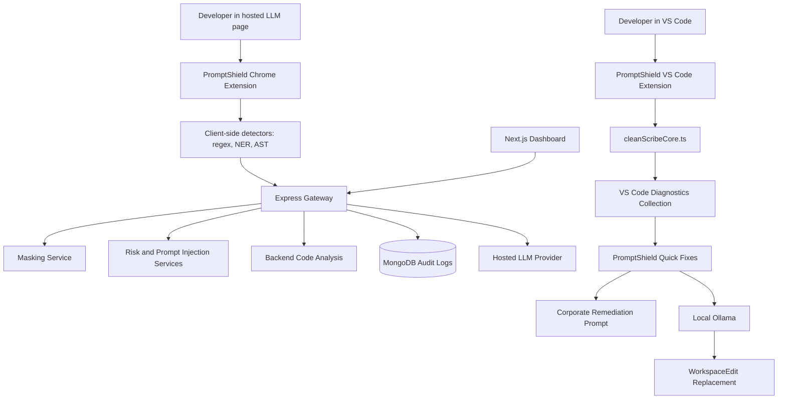
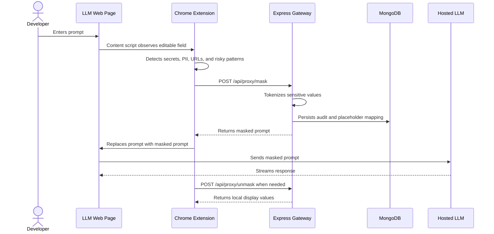
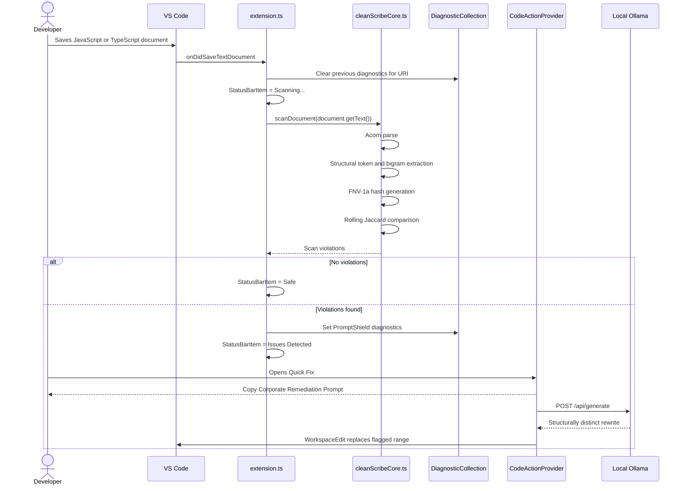

# PromptShield Technical Context

This file is the handoff reference for future agents and developers working in this repository. It records the current architecture, important implementation details, validation status, and recent changes.

Last updated: May 28, 2026

## Current Repository State

PromptShield is a local edge-security gateway for LLM data-loss prevention and code compliance. The repository currently contains four main surfaces:

| Surface | Path | Purpose |
| --- | --- | --- |
| Dashboard | `app/` | Next.js dashboard shell for administrative and future audit views. |
| Chrome extension | `promptshield-chrome-extension/` | Browser-side prompt interception, masking, unmasking, and page UI feedback. |
| Backend gateway | `ai-firewall-backend/` | Express API for masking, unmasking, chat proxying, risk scoring, and audit persistence. |
| VS Code extension | `promptshield-vscode-extension/` | In-editor compliance scanner, Problems diagnostics, quick fixes, and local AI remediation. |
| SDK module | `sdk_module/omnishield-core-sdk/` | Standalone scanner/redaction module retained from earlier project naming. |

Important naming note: the active feature and product name is `PromptShield`. Do not introduce new `OmniShield` or `CleanScribe` names unless preserving legacy SDK paths that already exist.

## Recent Agent Work

The most recent work focused on creating and hardening the VS Code extension under `promptshield-vscode-extension/`, cleaning repository metadata, and refreshing documentation.

Completed changes:

- Created the VS Code extension scaffold using TypeScript and Webpack.
- Added `promptshield-vscode-extension/src/cleanScribeCore.ts` as a pure scanner module with no `vscode` import.
- Implemented Acorn AST parsing, structural token extraction, bigram generation, FNV-1a 32-bit hashing, mock Set-backed Bloom filter, and Jaccard similarity scanning.
- Hardened AST traversal to use an iterative stack plus `WeakSet` cycle guard instead of recursion.
- Changed structural fingerprints to use AST node types rather than identifier names so renamed code can still be detected.
- Changed the scanner from whole-document Jaccard comparison to fixed-size rolling restricted-hash windows to avoid dilution in larger files.
- Added `promptshield-vscode-extension/src/extension.ts` orchestration for save-time scanning, status bar state, and `PromptShield` diagnostics.
- Added `promptshield-vscode-extension/src/promptShieldDiagnostics.ts` for diagnostic source/code constants.
- Added `promptshield-vscode-extension/src/promptShieldCodeActions.ts` for Quick Fix actions.
- Added quick fixes:
  - `Copy Corporate Remediation Prompt`
  - `Auto-Fix with Local AI`
- Implemented local Ollama remediation using Node native `http`, no external fetch client.
- Ollama model order is `qwen2.5-coder:1.5b`, then fallback `gemma:3`.
- Capped Ollama response buffering at 2 MB.
- Verified `WorkspaceEdit` application and surfaced graceful VS Code error messages on failure.
- Added Jest tests for `cleanScribeCore.ts`.
- Renamed all new feature-facing identifiers from OmniShield to PromptShield.
- Rebuilt `README.md` with current architecture and flow diagrams.
- Fixed root package metadata typo from `promptsheild` to `promptshield`.
- Updated `.gitignore` for generated VS Code extension artifacts.

## Architecture Diagram



## Browser Prompt Protection Flow



## VS Code Compliance Flow



## VS Code Extension Details

Path: `promptshield-vscode-extension/`

Important files:

| File | Purpose |
| --- | --- |
| `src/extension.ts` | VS Code activation, save listener, status bar, diagnostics, and Quick Fix registration. |
| `src/cleanScribeCore.ts` | Pure scanner module. Does not import `vscode`. |
| `src/promptShieldDiagnostics.ts` | Diagnostic source and code constants. |
| `src/promptShieldCodeActions.ts` | CodeActionProvider and local AI remediation command. |
| `test/cleanScribeCore.test.ts` | Jest tests for core scanner behavior. |
| `webpack.config.js` | Bundles the extension entry into `dist/extension.js`. |

Activation events:

```json
[
  "onLanguage:javascript",
  "onLanguage:typescript"
]
```

Diagnostic behavior:

- Diagnostic collection name/source: `PromptShield`.
- Diagnostic code: `restricted-gpl-similarity`.
- Previous diagnostics are cleared with `diagnosticCollection.delete(document.uri)` before each scan.
- `critical` or `CRITICAL` severity maps to `vscode.DiagnosticSeverity.Error`.
- Status bar text states:
  - `Scanning...`
  - `Safe`
  - `Issues Detected`

Quick Fix behavior:

- The provider only responds to diagnostics where:
  - `diagnostic.source === "PromptShield"`
  - `diagnostic.code === "restricted-gpl-similarity"`
- `Copy Corporate Remediation Prompt` writes a hardcoded remediation instruction block to the VS Code clipboard.
- `Auto-Fix with Local AI` opens the flagged document, extracts the diagnostic range, calls Ollama, trims the response, and applies a `WorkspaceEdit`.
- HTTP uses Node native `http`.
- External libraries like `axios` or `node-fetch` are intentionally not used in the VS Code extension.

Ollama remediation details:

- Endpoint: `http://127.0.0.1:11434/api/generate`
- Primary model: `qwen2.5-coder:1.5b`
- Fallback model: `gemma:3`
- Request timeout: `120000` ms
- Max response bytes: `2 * 1024 * 1024`
- Error message instructs the user to start local Ollama and ensure one of the supported models is available.

## Core Scanner Details

File: `promptshield-vscode-extension/src/cleanScribeCore.ts`

Public exports:

- `AstStructuralToken`
- `AstBigram`
- `ViolationSeverity`
- `ScanViolation`
- `MockBloomFilter`
- `parseAstTokens(code: string)`
- `extractBigrams(tokens)`
- `fnv1a32(value: string)`
- `scanDocument(code: string)`
- `calculateJaccardSimilarity(left, right)`

Scanner pipeline:

1. Normalize common TypeScript-only syntax into Acorn-compatible JavaScript-like source.
2. Parse with Acorn using `ecmaVersion: "latest"`, `sourceType: "module"`, and location tracking.
3. Traverse AST iteratively using a stack.
4. Emit structural tokens with node type, optional name, and line.
5. Convert adjacent structural tokens into bigrams.
6. Hash bigram strings with FNV-1a 32-bit.
7. Compare rolling windows of document hashes against a hardcoded restricted hash Set.
8. Emit one violation if best Jaccard similarity is at least `0.75`.

Important design choices:

- Bigrams use node type only for matching, not identifier names.
- The traversal is iterative to avoid call-stack issues on deeply nested input.
- A `WeakSet` prevents revisiting nodes if unusual AST objects contain cycles.
- The scanner is stateless and safe to call repeatedly.
- The mock Bloom filter is intentionally a `Set<number>` for prototype determinism.

Known limitations:

- Acorn does not natively parse full TypeScript. The current TypeScript support is a light normalization pass and will not handle every advanced TS construct.
- Restricted GPL hashes are prototype hardcoded fingerprints, not a real production signature database.
- `scanDocument` currently emits a single violation for the best restricted match.

## Test Suite

VS Code extension tests:

```bash
cd promptshield-vscode-extension
npm install
npm test
npm run typecheck
npm run compile
npm audit --omit=optional
```

Current core tests in `test/cleanScribeCore.test.ts`:

- Clean code returns zero violations.
- Structurally plagiarized restricted logic returns one violation.
- FNV-1a hashing is stable and returns the expected integer for the same string.

Last verified results:

- Jest: 3 tests passed.
- TypeScript: zero errors.
- Webpack: compiled successfully.
- npm audit for VS Code extension: zero vulnerabilities.

Backend tests:

```bash
cd ai-firewall-backend
node test/code-analysis.test.js
```

SDK tests:

```bash
cd sdk_module/omnishield-core-sdk
node test-sdk.js
node test-edge-cases.js
```

## Repository Hygiene

Generated outputs are ignored and should not be committed:

- `node_modules/`
- `.next/`
- `dist/`
- `coverage/`
- `.vscode-test/`
- `*.vsix`
- `.env*`
- editor metadata

Recent cleanup removed:

- `.next/`
- `promptshield-vscode-extension/node_modules/`
- `promptshield-vscode-extension/dist/`

Note: some root `node_modules` native binary folders may remain if Windows locks files while Node, Next.js, or VS Code extension host processes are running. They are ignored. Close Node processes before removing them.

## Backend Gateway

Path: `ai-firewall-backend/`

Primary files:

- `server.js`: Express app initialization.
- `config/db.js`: MongoDB connection.
- `routes/proxyRoutes.js`: Proxy route registration.
- `controllers/proxyController.js`: Mask, unmask, chat, and audit handlers.
- `models/AuditLog.js`: Mongoose audit log schema.
- `services/maskingService.js`: Placeholder token generation and masking.
- `services/openaiService.js`: Hosted LLM integration.
- `services/promptInjectionService.js`: Prompt-injection pattern detection.
- `services/riskService.js`: Risk scoring.
- `services/codeAnalysis/`: Backend AST and license analysis.

Default local endpoint:

```text
http://localhost:5000
```

Known routes:

| Endpoint | Method | Purpose |
| --- | --- | --- |
| `/api/proxy/mask` | POST | Mask sensitive prompt content. |
| `/api/proxy/unmask` | POST | Restore placeholders locally. |
| `/api/proxy/chat` | POST | Proxy LLM chat with scanning hooks. |
| `/api/audit/logs` | GET | Retrieve audit records. |

Environment example:

```bash
PORT=5000
MONGO_URI=mongodb://localhost:27017/promptshield
NODE_ENV=development
```

Do not commit `.env` files.

## Chrome Extension

Path: `promptshield-chrome-extension/`

Key folders:

- `background/`: service worker, audit helper, Ollama helper.
- `content/`: observer, injector, interceptor, badge, toast.
- `parser/`: regex, NER, AST, and parser composition.
- `utils/`: constants and masking helpers.
- `icons/`: extension image assets.

Manifest:

- Manifest V3.
- Host permissions currently include Gemini, ChatGPT, Copilot, and localhost.
- Content scripts load parser utilities before content observers/interceptors.

## Dashboard

Path: `app/`

Stack:

- Next.js 16
- React 19
- Tailwind CSS 4
- TypeScript

Important instruction from `AGENTS.md`:

- This project uses a Next.js version with breaking changes.
- Before editing Next.js code, read relevant docs in `node_modules/next/dist/docs/` if dependencies are installed.

## Setup Commands

Root dashboard:

```bash
npm install
npm run dev
```

Backend:

```bash
cd ai-firewall-backend
npm install
npm run dev
```

VS Code extension:

```bash
cd promptshield-vscode-extension
npm install
npm test
npm run typecheck
npm run compile
```

Ollama:

```bash
ollama pull qwen2.5-coder:1.5b
ollama pull gemma:3
ollama serve
```

Chrome extension:

1. Open `chrome://extensions`.
2. Enable Developer mode.
3. Select Load unpacked.
4. Choose `promptshield-chrome-extension/`.

## Guidance For Future Agents

- Prefer the `promptshield-vscode-extension/` implementation over any old deleted `vscode-extension/` references.
- Keep the core scanner pure. Do not import `vscode` into `cleanScribeCore.ts`.
- Keep local AI remediation offline-first and local-only through `127.0.0.1`.
- Avoid reintroducing external HTTP clients into the VS Code extension.
- Keep generated folders out of git.
- If updating the Next.js app, first inspect the installed Next.js docs because the project uses a newer Next.js version.
- Use `rg` to find stale names before renaming anything.
- Use `npm.cmd` on Windows if PowerShell blocks `npm.ps1`.

