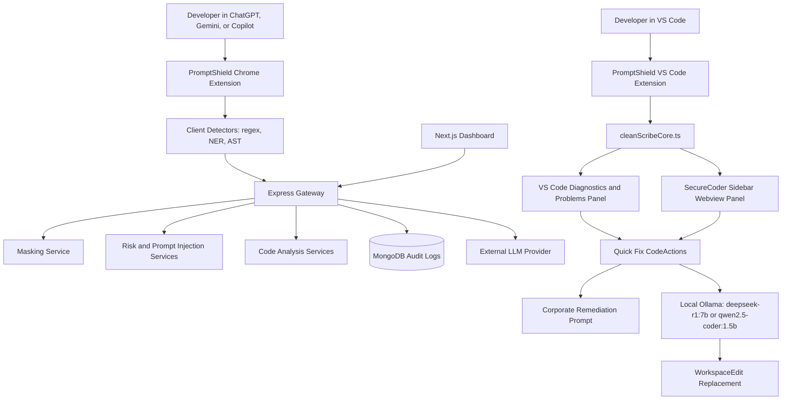
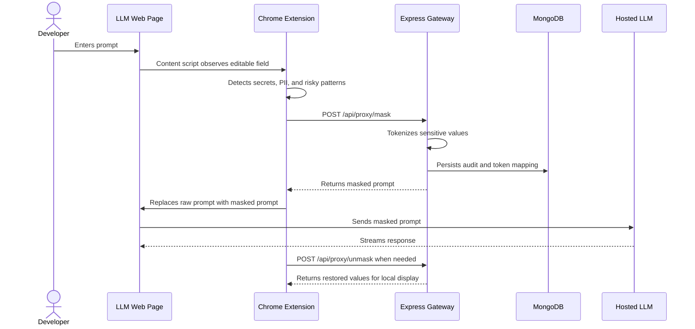
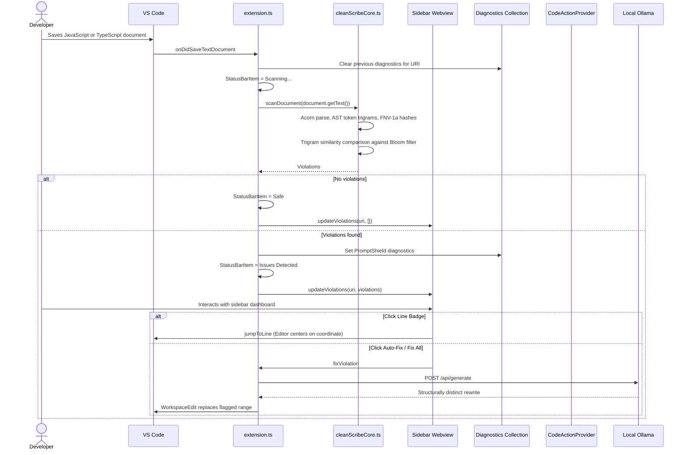
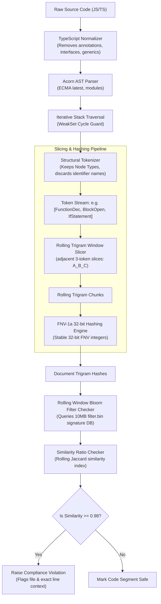

# PromptShield

Local edge-security gateway for prompt data-loss prevention, code compliance scanning, and in-editor remediation.


## Overview

PromptShield protects developer workflows at two edges:

- Browser edge: a Chrome Manifest V3 extension detects sensitive prompt content before it reaches hosted LLM interfaces.
- IDE edge: a VS Code extension scans JavaScript and TypeScript source on save, raises Problems diagnostics, and offers local AI remediation through Ollama.

The repository also includes a local Express gateway for masking, unmasking, audit logging, and response analysis, plus a lightweight SDK module for reusable scanner logic.

## Repository Map

```text
heritage/
|-- app/                              Next.js dashboard shell
|-- components/                       Shared UI components
|-- lib/                              Frontend utilities
|-- public/                           Static assets
|-- ai-firewall-backend/              Express gateway and audit services
|   |-- config/                       MongoDB connection
|   |-- controllers/                  Proxy route handlers
|   |-- models/                       Audit log schema
|   |-- routes/                       API routes
|   |-- services/                     Masking, risk, injection, code analysis
|   `-- test/                         Backend code-analysis tests
|-- promptshield-chrome-extension/    Chrome MV3 prompt protection client
|   |-- background/                   Service worker, audit, Ollama helpers
|   |-- content/                      DOM observer, badge, interceptor, toast
|   |-- parser/                       Regex, NER, and AST detectors
|   |-- utils/                        Constants and masking helpers
|   `-- icons/                        Extension icon assets
|-- promptshield-vscode-extension/    VS Code compliance extension
|   |-- src/                          Extension entrypoint, scanner, quick fixes
|   |-- test/                         Jest tests for cleanScribeCore
|   |-- package.json                  Extension manifest and scripts
|   `-- webpack.config.js             VS Code extension bundling
`-- sdk_module/                       Standalone scanner SDK module
```

## Architecture



## Browser Protection Flow



## VS Code Compliance Flow



## AST Structural Fingerprinting & Hashing Pipeline

To accurately detect GPL-licensed plagiarism and copyleft functional code segments regardless of changes in variable naming, formatting, or function ordering, PromptShield employs an advanced AST extraction, normalization, sliding trigram, and Bloom filter verification pipeline:



## Core Components

| Component | Path | Responsibility |
| --- | --- | --- |
| Dashboard | `app/` | Administrative UI shell for security posture and future audit views. |
| Chrome extension | `promptshield-chrome-extension/` | Browser-side prompt interception, masking, unmasking, and UI feedback. |
| Gateway | `ai-firewall-backend/` | Express API for mask, unmask, chat proxy, risk scoring, and audit persistence. |
| VS Code extension | `promptshield-vscode-extension/` | On-save source scanning, Problems diagnostics, quick fixes, and local AI remediation. |
| Core scanner | `promptshield-vscode-extension/src/cleanScribeCore.ts` | Pure TypeScript AST tokenization, bigram hashing, and Jaccard similarity detection. |
| SDK module | `sdk_module/omnishield-core-sdk/` | Standalone reusable scanner and redaction logic. |

## VS Code Extension Internals

The VS Code extension is intentionally split into a UI orchestration layer and a pure scanner layer.

```text
promptshield-vscode-extension/src/
|-- extension.ts                  Registers save listener, status bar, diagnostics, quick fixes, webview
|-- cleanScribeCore.ts            Pure scanner; no vscode import
|-- promptShieldDiagnostics.ts    Diagnostic source and code constants
|-- promptShieldCodeActions.ts    Quick Fix actions and local Ollama integration
|-- promptShieldWebviewProvider.ts Webview view provider for 'SecureCoder' dashboard
`-- localBloomFilter.ts           Binary Bloom filter rules loading and matching
```

Important properties:

- `cleanScribeCore.ts` is stateless and does not import `vscode`.
- Diagnostics are stored in a single collection named `PromptShield`.
- Previous diagnostics are cleared before every save-time scan.
- Local remediation uses Node's native `http` module.
- Ollama requests dynamically discover local models and rank/prioritize reasoning models (`deepseek-r1:7b` etc.) and coding models (`qwen2.5-coder:1.5b` etc.) first.
- Ollama responses are capped to avoid unbounded buffering.

## API Surface

The gateway runs on `http://localhost:5000` by default.

| Endpoint | Method | Purpose |
| --- | --- | --- |
| `/api/proxy/mask` | POST | Replace sensitive values with local placeholders. |
| `/api/proxy/unmask` | POST | Restore placeholder values for local display. |
| `/api/proxy/chat` | POST | Proxy LLM requests with scanning and audit hooks. |
| `/api/audit/logs` | GET | Retrieve persisted audit events. |

## Setup

### Root dashboard

```bash
npm install
npm run dev
```

The dashboard uses Next.js and starts on the port selected by the Next.js dev server.

### Backend gateway

```bash
cd ai-firewall-backend
npm install
npm run dev
```

Create `ai-firewall-backend/.env` locally:

```bash
PORT=5000
MONGO_URI=mongodb://localhost:27017/promptshield
NODE_ENV=development
```

Do not commit `.env` files.

### Chrome extension

1. Open `chrome://extensions`.
2. Enable Developer mode.
3. Choose Load unpacked.
4. Select `promptshield-chrome-extension/`.

### VS Code extension

```bash
cd promptshield-vscode-extension
npm install
npm run typecheck
npm test
npm run compile
```

For local AI remediation:

```bash
ollama pull deepseek-r1:7b
ollama pull qwen2.5-coder:1.5b
ollama serve
```

## Test Commands

```bash
# Root dashboard lint
npm run lint

# Backend code-analysis tests
cd ai-firewall-backend
node test/code-analysis.test.js

# SDK validation
cd sdk_module/omnishield-core-sdk
node test-sdk.js
node test-edge-cases.js

# VS Code extension core tests
cd promptshield-vscode-extension
npm test
```

## Repository Hygiene

Generated and local-only outputs are intentionally ignored:

- `node_modules/`
- `.next/`
- `dist/`
- `coverage/`
- `.env*`
- editor metadata

If Windows keeps native `.node` binaries locked inside `node_modules`, close running Node, Next.js, or VS Code extension host processes and rerun cleanup.

## Current Validation Status

The PromptShield VS Code extension was validated with:

```bash
npm test
npm run typecheck
npm run compile
npm audit --omit=optional
```

The last successful validation reported passing Jest tests, zero TypeScript errors, a successful Webpack bundle, and zero npm audit vulnerabilities for the extension package.

## License

PromptShield is proprietary enterprise software. All rights reserved.
