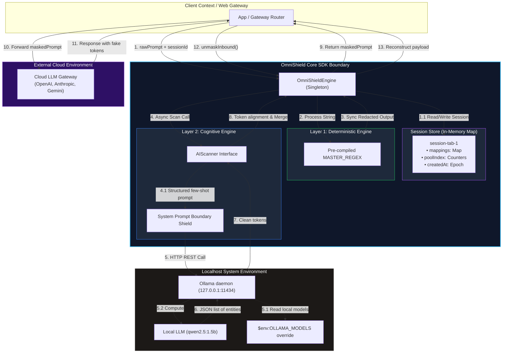
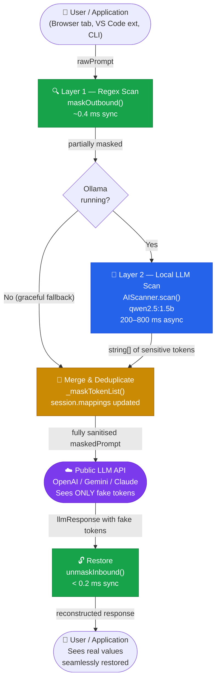
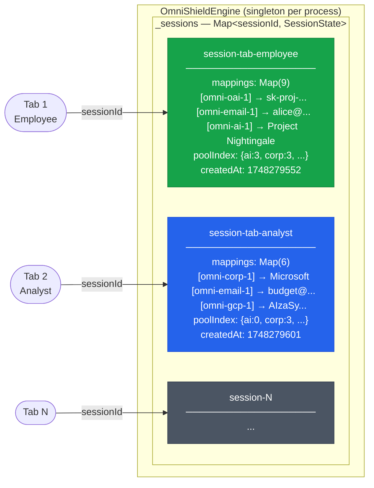
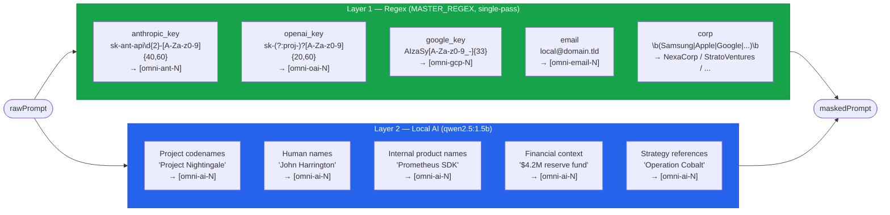

# OmniShield AI — Core SDK

> **Zero-Dependency. Sub-Millisecond. Zero Cloud Leaks.**  
> A lightweight, deterministic data firewall and bi-directional tokenization engine sitting between your application and public LLM APIs (OpenAI, Gemini, Claude, etc.).

---

## 1. Overview & Core Paradigm

`omnishield-core-sdk` operates as an **AI Firewall** to redact sensitive records (API keys, emails, corporate names) before they leave your environment, and restores them seamlessly when public LLM responses return. It combines ultra-fast deterministic regex rules with high-accuracy local cognitive models.

```
┌────────────────────────────────────────────────────────────────────────┐
│                              Application                               │
└──────────────────────────────────┬─────────────────────────────────────┘
                                   │ (rawPrompt)
                                   ▼
┌────────────────────────────────────────────────────────────────────────┐
│                     OmniShield Engine (Localhost)                      │
│                                                                        │
│  ┌───────────────────────────┐           ┌──────────────────────────┐  │
│  │   Layer 1: Regex Scan     │           │   Layer 2: Local LLM     │  │
│  │   • Pre-compiled RegEx    ├──────────►│   • qwen2.5:1.5b         │  │
│  │   • Latency: < 0.5 ms     │           │   • Latency: 200-800 ms  │  │
│  └───────────────────────────┘           └──────────────────────────┘  │
└──────────────────────────────────┬─────────────────────────────────────┘
                                   │ (fully maskedPrompt)
                                   ▼
┌────────────────────────────────────────────────────────────────────────┐
│                         Public LLM (Cloud)                             │
│                      (OpenAI / Gemini / Claude)                        │
└──────────────────────────────────┬─────────────────────────────────────┘
                                   │ (llmResponse with fake tokens)
                                   ▼
┌────────────────────────────────────────────────────────────────────────┐
│                        unmaskInbound() (Local)                         │
└──────────────────────────────────┬─────────────────────────────────────┘
                                   │ (reconstructed real response)
                                   ▼
┌────────────────────────────────────────────────────────────────────────┐
│                              Application                               │
└────────────────────────────────────────────────────────────────────────┘
```

### Key Capabilities:
* **Dual-Layer Defense**:
  * **Layer 1 — Regex**: Dynamic, single-pass RegExp scanning catching structured tokens (API keys, email addresses, corporate entities) in **< 0.5 ms**.
  * **Layer 2 — Local AI**: A secure cognitive scanner running `qwen2.5:1.5b` locally via Ollama to redact names, proprietary terms, and project codenames.
* **100% In-Memory Mappings**: Session records are held in standard Node `Map` tables isolated by `sessionId`.
* **Zero External npm Dependencies**: Built purely with native Node.js core libraries (`node:http`, `node:assert`, etc.).
* **Idempotency Guarantees**: Running the scanner on already-redacted text returns **zero** new tokens, preventing pattern contamination.

---

## 2. Detailed Architecture Blueprint

This diagram illustrates how the SDK boundary encapsulates the deterministic scanner, cognitive interface, and local session tables to process payloads in complete network isolation.



---

## 3. Full Data Flow Pipeline

The SDK maintains transactional safety by tokenizing outgoing inputs and dynamically reversing the substitution map on response streams.



---

## 4. Session Isolation Model

Each tab, prompt thread, or user context holds a designated `sessionId` targeting isolated memory states, avoiding crosstalk or leak risks.



---

## 5. Detection Pattern Taxonomy



---

## 6. Setup & Running Guide

Follow this guide to initialize, configure, and validate `omnishield-core-sdk` on your local environment.

### Prerequisites
* **Node.js**: $\ge$ Version 18.
* **Ollama**: Local model execution engine. Install from [ollama.com](https://ollama.com).

### Step 1 — Local Model Storage Paths (Optional)
If you wish to configure a custom storage path for Ollama's downloaded models:

**For Windows (PowerShell):**
```powershell
$env:OLLAMA_MODELS="C:\Users\your_user_name\.ollama\models"
```

**For macOS / Linux (Terminal):**
```bash
export OLLAMA_MODELS="~/.ollama/models"
```

### Step 2 — Start Ollama Daemon
Start the server listening on the default local port (`11434`):

```powershell
ollama serve
```

### Step 3 — Pull Recommended LLM Model
Download the high-efficiency `qwen2.5:1.5b` model:

```powershell
ollama pull qwen2.5:1.5b
```

Verify downloaded models:

```powershell
ollama list
```

### Step 4 — Run Local SDK Test Suites
Navigate into the SDK directory:

```powershell
cd c:\Users\abhay\OneDrive\Desktop\heritage\sdk_module\omnishield-core-sdk
```

#### A. Execute Comprehensive Test Suite
Validates pattern detection limits, singleton stability, high-frequency performance stress, and real LLM scanner calls:
```powershell
node test-sdk.js
```

#### B. Execute Custom Edge-Cases & Security Suite
Validates tag rendering, HTML nesting, Unicode symbols, and prompt injection defense layers:
```powershell
node test-edge-cases.js
```

---

## 7. Quick Code Integration Example

Integrating OmniShield into an LLM proxy or API gateway is straightforward:

```javascript
const engine = require('./index');

async function processSecureSession(sessionId, rawUserPrompt) {
  // 1. Dual-layer outbound redaction (Regex + Local LLM AI scan)
  const redactResult = await engine.maskOutboundWithAI(sessionId, rawUserPrompt);
  
  console.log('Sanitised string for cloud:', redactResult.maskedPrompt);

  // 2. Safely call public cloud LLM API with masked content
  const rawLlmResponse = await callPublicCloudLLM(redactResult.maskedPrompt);

  // 3. De-tokenize response payload, seamlessly restoring original variables
  const restoredText = engine.unmaskInbound(sessionId, rawLlmResponse);
  
  console.log('Restored text to return to client:', restoredText);

  // 4. Wipe session tracking maps when context is closed
  engine.clearSession(sessionId);
}
```

---

## 8. Latency Budgets & SLA Goals

| Method | Typical Latency | Target SLA | Execution Type |
|---|---|---|---|
| `maskOutbound` | < 0.4 ms | < 5 ms | Synchronous |
| `unmaskInbound` | < 0.2 ms | < 2 ms | Synchronous |
| `isAvailable` | < 2 ms | < 5 ms | Asynchronous |
| `scan` (Local LLM) | 200 - 800 ms | < 15,000 ms | Asynchronous |

*The local LLM processing (200–800 ms) sits parallel to typical public cloud LLM processing windows (1,000–5,000 ms), resulting in virtually no perceivable overhead for interactive applications.*

---

## 9. Extending & Swapping Models

### Swap the AI Model
```javascript
const result = await engine.maskOutboundWithAI(sessionId, prompt, {
  aiOptions: {
    model: 'gemma3:4b', // swap to larger or custom models
    temperature: 0.1
  }
});
```

### Add a New Regex Category
1. Add custom placeholder codes in `POOLS`.
2. Map your regular expression to `PATTERNS`.
3. Add the capture group directly in the `MASTER_REGEX` template.
4. Bind counter offsets under `_createSessionState()`.
